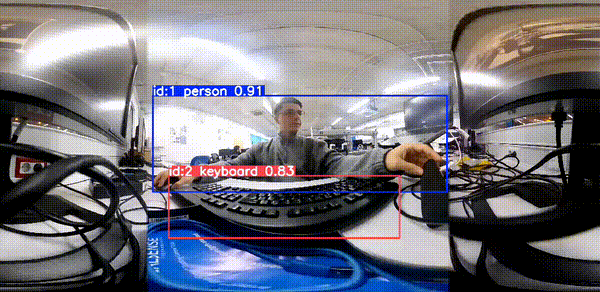

# 360° Tracking for Ricoh Theta Z1 (ROS 2)

## Overview

`tracker_360` is a ROS 2 package for **real-time person detection and tracking** in 360° equirectangular images captured with a **Ricoh Theta Z1** camera. It supports both **multi-object tracking** using YOLO + ByteTrack and **single-object tracking** using CSRT, with panoramic crop and seam-wrap support.

The system enables detection and tracking across full 360° images, with the ability to extract cropped views of specific tracked targets.

---

## Single Object Tracking (SOT)

This mode focuses on tracking a **single target** once it has been initially detected. The cropped view is adjusted dynamically frame-by-frame.

### CSRT Algorithm

* **CSRT (Discriminative Correlation Filter with Channel and Spatial Reliability)** is a robust visual tracking algorithm based on correlation filters.
* It builds a model of the object's appearance and **updates it continuously** with each new frame.
* The algorithm creates a **discriminative filter** trained to respond strongly at the target location and suppress background activations.
* **Channel reliability** evaluates which feature channels (color, gradient, etc.) are most stable and informative and assigns them higher weights.
* **Spatial reliability** applies a mask to down-weight unstable parts of the bounding box, focusing on stable core regions.
* CSRT is resilient to **scale changes, partial occlusions, and object deformation**, though it relies on a reliable first detection.

<div align="center">
  
</div>


### Set Tracked

* The tracking target is automatically initialized as the first detection found by YOLO in the first frame.
* If tracking is lost, YOLO reinitializes the tracker on the next visible detection.
* The cropped region is sent to `/object_crop`, and the full frame with annotations is published on `/object_annotated`.

---

## Multi Object Tracking (MOT)

This mode supports tracking **multiple persons simultaneously**, each with its own persistent ID.

### ByteTrack

* **ByteTrack** is a **tracking-by-detection** algorithm that links object detections across time.
* In each frame, YOLO generates bounding boxes, and ByteTrack associates them with tracks using the following:

  * **IoU (Intersection over Union)** to compare current detections with previous positions.
  * A **Kalman filter** to predict the expected position of each tracked object.
  * The **Hungarian algorithm** for optimal matching between predictions and new detections.
* ByteTrack is unique in that it retains **low-confidence detections** to help re-associate temporarily lost tracks, increasing tracking continuity.
* It operates at high speed, has low computational overhead, and works well even in **crowded scenes** with occlusions.

<div align="center">
  
</div>


### Follow a Specific ID

You can dynamically change the ID to follow using ROS parameters:

```bash
ros2 param set /multi_person_tracker object_tracked "'3'"
```

To reset to full image mode:

```bash
ros2 param set /multi_person_tracker object_tracked "'full_image'"
```

The annotated panoramic image with all IDs is published on `/multi_object_tracker`.

---

## Crop and Wrap

360° panoramas have a **wrap-around seam** at the 0°/360° boundary. Objects split by the seam can be hard to crop directly due to their split appearance.

To handle this, the `crop_and_wrap()` utility reconstructs a **continuous crop** even when the object spans the seam:

### How it works:

1. The bounding box is padded, and its horizontal coordinates (`x1`, `x2`) are analyzed.
2. If `x1 < 0` or `x2 > image width`, it indicates the object crosses the panorama seam.
3. The crop is split into two valid regions: one on the right border, and one on the left.
4. The function extracts both parts and horizontally **concatenates them** (`np.hstack()`), forming a seamless crop.
5. The result is a **wrapped crop**, preserving object continuity near 0°/360°.


---

## ROS 2 Usage

### Run Nodes Separately

In one terminal:

```bash
ros2 run tracker_360 theta_node
```

In another terminal (multi-object tracking mode):

```bash
ros2 run tracker_360 multi_person_tracker.py 
```

For single-object CSRT tracking:

```bash
ros2 run tracker_360 yolo_tracker.py
```

### Launch Files

Alternatively, use launch files:

```bash
ros2 launch tracker_360 multi_tracker_launch.py
```

```bash
ros2 launch tracker_360 single_tracker_launch.py
```

---

## Topics

| Topic Name              | Type                | Direction | Description                               |
| ----------------------- | ------------------- | --------- | ----------------------------------------- |
| `/stitched_image`       | `sensor_msgs/Image` | Sub       | Input panorama from Ricoh Theta Z1        |
| `/multi_object_tracker` | `sensor_msgs/Image` | Pub       | Annotated image with tracked IDs (MOT)    |
| `/object_crop`          | `sensor_msgs/Image` | Pub       | Cropped image around tracked object (SOT) |
| `/object_annotated`     | `sensor_msgs/Image` | Pub       | Full image annotated with current object  |

---

